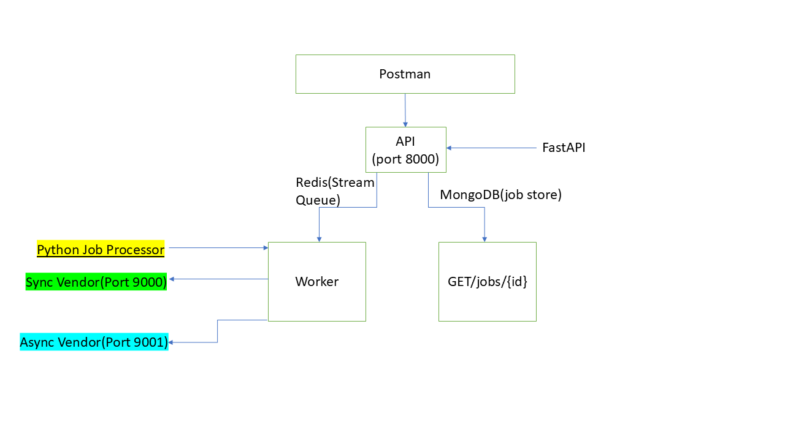

Multi-Vendor Data Fetch Service

This is a offline coding test solution to develop a backend to manage job submissions and result retrieval from vendor systems (sync and async), built using FastAPI, Redis, MongoDB, and Docker.

 <!-- Step 1: Firstly Clone and navigate into the repo -->

git clone <your-repo-url>
cd multi-vendor-service

 <!-- Step 2: Build and start all services -->

docker compose up --build

<!-- Here is the architecture diagram -->

